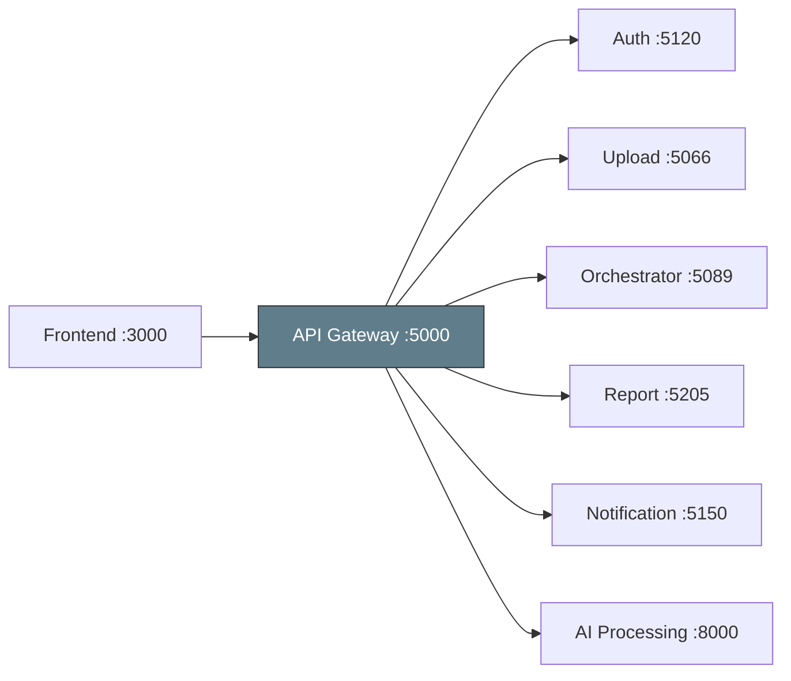

# :globe_with_meridians: ArchLens API Gateway

Reverse proxy gateway with JWT authentication, role-based authorization, and rate limiting.

## Architecture Overview



## Tech Stack

| Technology | Purpose |
|---|---|
| .NET 9 | Runtime |
| YARP | Reverse proxy engine |
| JWT Bearer | Authentication |
| Role-based auth | User / Admin authorization |
| Rate Limiting | Request throttling |

## Route Map

| Route Pattern | Target Service | Auth Required |
|---|---|---|
| `/auth/**` | Auth Service :5120 | Varies |
| `/api/upload/**` | Upload Service :5066 | Yes |
| `/saga/**` | Orchestrator :5089 | Yes |
| `/reports/**` | Report Service :5205 | Yes |
| `/hubs/**` | Notification :5150 | Yes |
| `/api/analyze`, `/api/chat` | AI Processing :8000 | Yes |

## Running

```bash
dotnet run --project src/ArchLens.Gateway.Api
```

The gateway starts on **port 5000**.

## Environment Variables

| Variable | Description | Default |
|---|---|---|
| `Jwt__Key` | JWT signing key (must match Auth Service) | — |
| `Jwt__Issuer` | Token issuer | — |
| `Jwt__Audience` | Token audience | — |
| `ReverseProxy__Clusters__*__Destinations__*__Address` | Backend service URLs | — |
